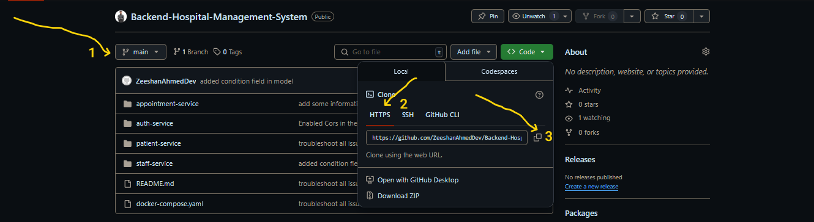
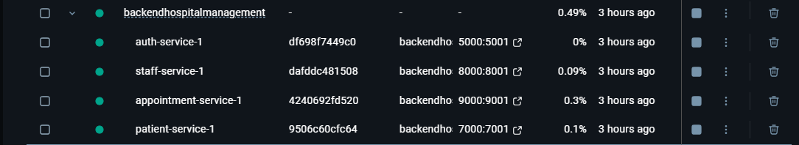

# Hospital Management System — Backend Project

This is the **backend** for the Hospital Management System, built using **Node.js**, **Express**, and **MongoDB**. The backend is organized in a **microservices architecture** and designed for performance, flexibility, and maintainability. It provides a RESTful API for handling patients, staff, appointments, admissions, authentication, and medical records. The backend is fully containerized using Docker.

---

##  Key System Requirements

Our system is developed considering the following essential principles:

* **Elasticity**: Handles high volumes of concurrent users without performance issue.
* **Adaptability**: Easily accommodates new features and updates with minimal tweaks.
* **Reliability**: Built for continuous availability to avoid downtime that could impact hospital operations.
* **Performance**: Ensures fast responses for key actions like booking or canceling appointments and so on.
* **Scalability**: Designed to manage increased user load without affecting user experience (UX).
* **Simplicity**: Offers intuitive and clear APIs, making it easy to integrate with any frontend. (We have Postman Collection for that)
* **Modularity**: Hospital Management System Backend Built with a microservices design. Each service is independently manageable and maintainable.

---

## Microservices Architecture

Each service handles a specific responsibility:

* **Auth Service** — User registration, login, and forgot password API authentication.
* **Patient Service** — Manages patient profiles and medical records.
* **Staff Service** — Manages doctors, schedules, and ward assignments.
* **Appointment Service** — Handles appointment creation, updates, and retrieval.

You can refer to the system diagram below:


---

## Getting Started with the Project

### 1. Clone the repository

```bash
git clone https://github.com/ZeeshanAhmedDev/Backend-Hospital-Management-System.git
cd Backend-Hospital-Management-System
```

### 2. Open termail and run command below

```bash
docker-compose up --build
```

The services will start on the following ports:

| Service             | Port  |
| ------------------- | ----- |
| Auth Service        | 5000:5001 |
| Appointment Service | 6000:6001 |
| Patient Service     | 7000:7001 |
| Staff Service       | 8000:8001 |


> Please ensure that you have Docker and Docker Compose installed.

---

##  API Endpoints

Please go to the provided link below, A postman collection for the APIs for each service:

[Postman Collection - Hospital Management System](screenshots/Hospital%20Management%20System.postman_collection.json)

download it and import it into the postman desktop application.


---


## Follow ScreenShots. If you still have not gotten the description

### Step 01: Clone the repo


### Step 02: Enter the Command in the terminal


### Step 03: You will see the port running in Docker



---


### For Frontend Setup

Refer to the frontend guide: [Frontend - Hospital Management System](https://github.com/ZeeshanAhmedDev/Hospital-Management-System)

---

## Conclusion

This backend is a scalable with its microservices architecture and Docker-based deployment, it ensures high performance, reliability, and flexibility.


Thank you for using our Hospital Management System Backend.

